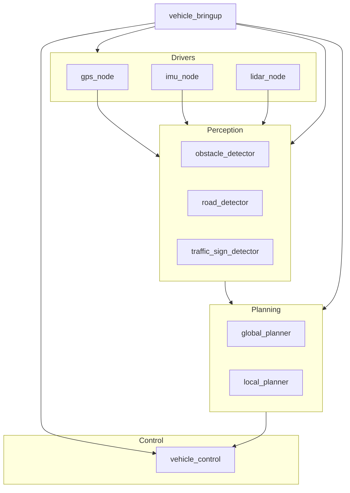
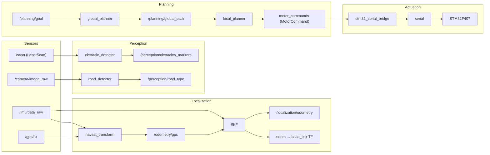

# ROS2 功能包节点与通信关系

## 功能包与依赖关系

### 1. `vehicle_bringup`

- 类型：Python 包
- 测试依赖：`ament_copyright`，`ament_flake8`，`ament_pep257`，`python3-pytest`
- 无运行时依赖。

### 2. `vehicle_control`

- 类型：Python 包
- 测试依赖：`ament_copyright`，`ament_flake8`，`ament_pep257`，`python3-pytest`
- 无运行时依赖。

### 3. `gps_node`

- 类型：C++ 包
- 运行时依赖：`rclcpp`，`std_msgs`，`sensor_msgs`
- 启动依赖：`ros2launch`

### 4. `imu_node`

- 类型：C++ 包
- 运行时依赖：`rclcpp`，`sensor_msgs`，`serial_driver`

### 5. `lidar_node`

- 类型：C++ 包
- 运行时依赖：`rclcpp`，`rclpy`，`sensor_msgs`，`std_srvs`，`serial_driver`

### 6. `vehicle_localization`

- 类型：Python 包
- 测试依赖：`ament_copyright`，`ament_flake8`，`ament_pep257`，`python3-pytest`
- 无运行时依赖。

### 7. `vehicle_perception`

- 类型：Python 包
- 测试依赖：`ament_copyright`，`ament_flake8`，`ament_pep257`，`python3-pytest`
- 无运行时依赖。

### 8. `vehicle_planning`

- 类型：Python 包
- 运行时依赖：`stm32_serial_bridge`

---

## 节点与通信话题

### 1. **GPS 节点**

- **`gps_publisher_node`**
  - 发布话题：
    - `/gps/fix` (`sensor_msgs/NavSatFix`)
    - `/gps/status` (`sensor_msgs/NavSatStatus`)
- **`gps_subscriber_node`**
  - 订阅话题：
    - `/gps/fix` (`sensor_msgs/NavSatFix`)

### 2. **IMU 节点**

- **`imu_driver_node`**
  - 发布话题：
    - `imu/data_raw` (`sensor_msgs/Imu`)
- **`imu_client_node`**
  - 订阅话题：
    - `imu/data_raw` (`sensor_msgs/Imu`)

### 3. **感知模块**

- **`obstacle_detector`**
  - 订阅话题：
    - `/scan` (`sensor_msgs/LaserScan`)
  - 发布话题：
    - `/perception/obstacles_markers` (`visualization_msgs/MarkerArray`)
- **`road_detector`**
  - 订阅话题：
    - `/camera/image_raw` (`sensor_msgs/Image`)
  - 发布话题：
    - `/perception/road_type` (`std_msgs/String`)
    - `/perception/road_mask` (`sensor_msgs/Image`)
- **`traffic_sign_detector`**
  - 订阅话题：
    - `/camera/image_raw` (`sensor_msgs/Image`)
  - 发布话题：
    - `/perception/traffic_signs` (`vision_msgs/Detection2DArray`)

### 4. **规划模块**

- **`global_planner`**
  - 订阅话题：
    - `/planning/goal` (`geometry_msgs/PoseStamped`)
    - `/localization/odometry` (`nav_msgs/Odometry`)
  - 发布话题：
    - `/planning/global_path` (`nav_msgs/Path`)
- **`local_planner`**
  - 订阅话题：
    - `/planning/global_path` (`nav_msgs/Path`)
    - `/localization/odometry` (`nav_msgs/Odometry`)
    - `/perception/obstacles_markers` (`visualization_msgs/MarkerArray`)
    - `/perception/road_type` (`std_msgs/String`)
  - 发布话题：
    - `/motor_servo_cmd` (`stm32_serial_bridge/MotorServoCmd`)

---

## 功能包依赖关系图

## 数据流

---

生成日期：2026年4月5日
